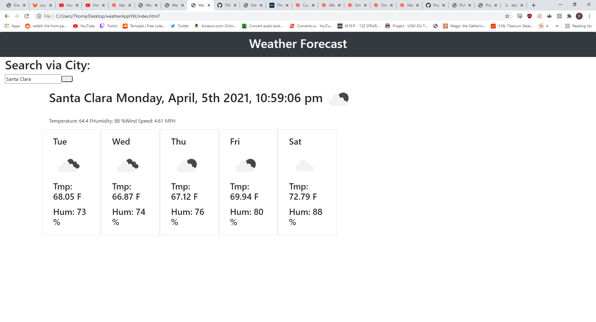

# weatherAppHW

The purpose of this assignment was to create a weather dashboard that included the current weather and time as well as a 5 day forecast that included various specifications (UV index, humidity, temperature, etc)

## Getting Started

I started a fresh repo and started generating all my files, then I started pseudocoding and taking notes about what functions and steps I needed to take in order to solve the problem. This homework had many similar elements to the daily planner EXCEPT the use of APIs and learning to READ THE DOCUMENTATION (which I wish that I had done more of)

### Prerequisites

In order to accomplish the goal of this assignment, I had to use VSCode for the HTML but particularly JavaScript as well as Gitbash for moving files between my repository and local machine. I also used Github to create the repository that I was sending to. This assignment also called for CSS for styling the elements that I appended and created via javascript in the HTML which was mostly done with Bootstrap framework. 

### Solving

The creation of the weather App was to be able to make clear functions to make fetch calls as well as control search parameters, get value from user input, render data on the page, make various API calls and learn the API syntax per feature, store things as local Storage, and stylize things with the given framework. I already knew before I started that I wanted to practice making a function for each essential part of my pseudocode, due to easter and various family obligations I didn't get as much time to work on this as I really wanted to and it's missing various functionality but that's something I'm confident that I understand how I could have solved. Nonetheless, I created functions for each of my various features or functionalities. Those functions were triggered by fetch API calls that I made in order to retrieve the weather data. Then the elements were dynamically generated using template literals (jQuery functions and having dom element pointers) and at the end of each render function they were appended to the page. Creating the 5 day forecast was more difficult than the single weather because I had to iterate through the array of json data and pick out the elements that I wanted to work with. Sometimes finding the correct syntax or the correct method or key name was difficult and eventually I needed to seek help and guidance from others on how I could sift through the time parameters because the json gave data every 3 hours for 5 days and I only wanted every 24 hours which basically required me to tweak my for loop and local variables in such a way that it returned me a true 5 day forecast. If I had to do it again I would absolutely have done it using a different API because I didn't read closely enough and didn't really understand that it was going to give me data for 3 hour intervals over the span of 5 days. Styling happened along the way basically thinking about which things needed to be contained in which manner. Overall I'm not incredibly happy with the layout and it's not exactly how I imagined it but it feels clear enough that I don't feel completely terrible about it. If I had more time, I would have liked to add an array of local storage objects equal to the value of the user input so that I could append them and add event listeners to make them clickable elements that clear and reappend elements to the page based on the city. I also would have made another API call for the UV index and appended it to its respectful location with the current day weather and whatnot. A known bug is that leaving the text input blank will return an error because I didn't have the time or prioritize adding some kind of alert or warning that the text field cannot be blank.

## Technologies Used

* [HTML](https://developer.mozilla.org/en-US/docs/Web/HTML)
* [JS](https://www.javascript.com/)
* [CSS](https://developer.mozilla.org/en-US/docs/Web/CSS)
* [Moment](https://momentjs.com/)
* [OpenWeatherAPI](https://openweathermap.org/api)

## Deployed Link

* [https://tmpeeler.github.io/weatherAppHW/](#)

## Code snippet of important work:

 var weatherOfTheDay = $(` 
    
 
    <h1>${city.name} ${date}</h1>
    
Temperature: ${city.main.temp} F

    
Humidity:  ${city.main.humidity} % 

    
Wind Speed: ${city.wind.speed} MPH 

    

    `);
    //using template literals again to create one giant object of HTML that will be appended (THIS IS PROBABLY THE BIGGEST LEARNING OF THIS WHOLE ASSIGNMENT THIS IS SO AWESOME)

    this is where I really understood that template literals will let you do crazy things that I must continue to research further

## Picture of website currently deployed

;

## Authors

* **Thomas Peeler** 

- [https://github.com/TMPeeler/weatherAppHW]

## Acknowledgments

* Special thanks to Alex, Liam, Jake, Mark, Javi, and Serena for all of their help and oversight in either helping each other come up with solutions, editing and debugging together, sharing syntax information, sharing skills and tricks, and generally being all very helpful and kind especially to me during this time and assignment.